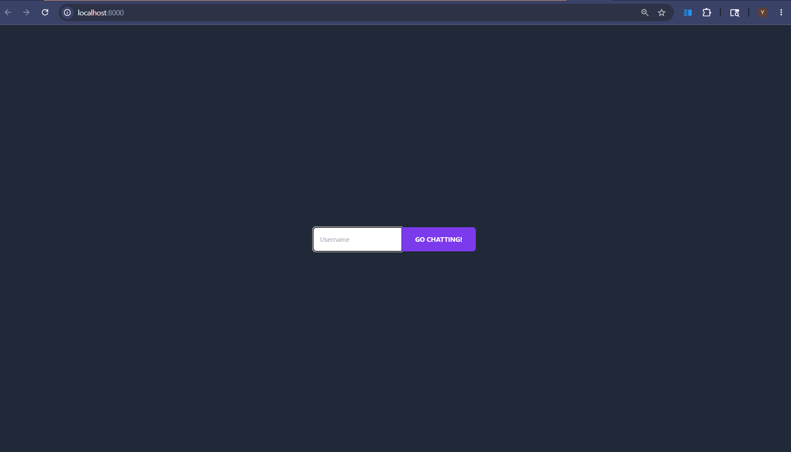
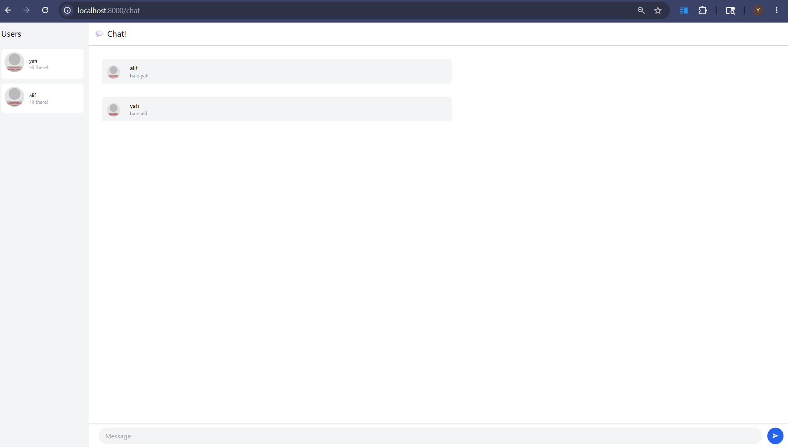

# Tutorial 3: WebChat using yew

## Experiment 3.1: Original Code of WebChat (Yew)
**Input Username**

**ChatRoom**

Pada eksperimen ini, saya mengkloning dan menguji coba kode *client* WebChat asli yang dibangun dengan ekosistem WebAssembly (WASM) menggunakan bahasa Rust dan framework Yew. Saya menggunakan *source code* dari repositori `YewChat` khusus pada *branch* `websockets-part2`, kemudian menyesuaikan konfigurasi *build tool*-nya agar aplikasi dapat dikompilasi dengan lancar menggunakan *environment* versi terbaru.

Saat aplikasi *client* dijalankan, alurnya adalah sebagai berikut:
1. Pengguna akan diarahkan ke halaman *login* untuk mendaftarkan *username*.
2. Setelah pendaftaran berhasil, *router* aplikasi akan memindahkan tampilan ke ruang obrolan (*chat room*) dan secara otomatis menginisiasi koneksi WebSocket ke *server* lokal di `ws://127.0.0.1:8080`.
3. Di dalam ruang obrolan, setiap pesan yang diketik akan disalurkan melalui **MPSC Channel** ke *server*, yang kemudian mem-*broadcast* pesan tersebut.
4. *Client* menggunakan komponen **Event Bus** untuk menangkap pesan *broadcast* dari *server* dan langsung me-*render* pembaruan UI secara *real-time* tanpa perlu me-*refresh* browser.

Proyek tutorial aslinya dibuat menggunakan versi *library* (seperti `wasm-bindgen`) dan modul *bundler* (`webpack`) yang saat ini sudah cukup usang. Hal ini menyebabkan ketidakcocokan (*incompatibility*) dengan *compiler* Rust modern, sehingga proses *build* ke WASM mengalami kegagalan. Oleh karena itu, saya perlu memperbarui *dependency* tersebut ke versi yang kompatibel agar aplikasi dapat berjalan sebagaimana mestinya tanpa harus mengubah struktur atau logika kode utama dari aplikasi *chat* itu sendiri.